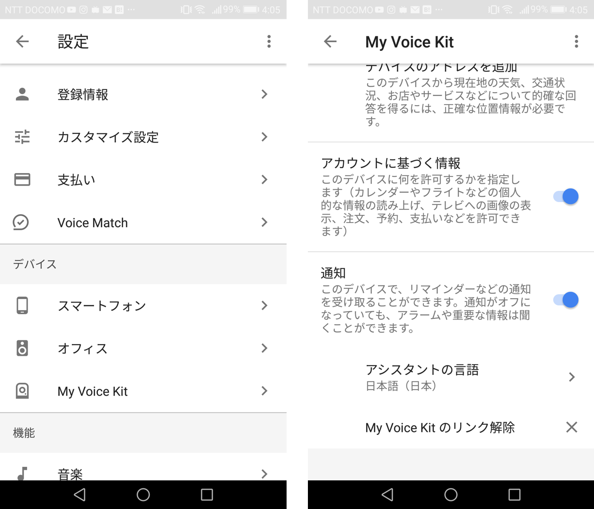

# register model and device

download client secret as JSON file from GCP console

move home folder (keep file name)
```sh
mv ~/Downloads/client_secret_* ~
```

oauth certification
```sh
google-oauthlib-tool --scope https://www.googleapis.com/auth/assistant-sdk-prototype --save --headless --client-secrets { your client secret file }
```

register model

```sh
cd ~
googlesamples-assistant-devicetool register-model --manufacturer "developer" --product-name "voicekit-sample" --type LIGHT --trait action.devices.traits.OnOff --model { your model id }
```

confirm model registering
```sh
googlesamples-assistant-devicetool list --model
```

register device
```sh
googlesamples-assistant-devicetool register-device --client-type LIBRARY --model { your model id } --device { your device id }
```

confirm device registering
```sh
googlesamples-assistant-devicetool list --device
```

# set language on Google Assistant App
launch google assistant app in your phone

tap blue button on the top left

tap setting on the top left


tap your device which registerd above step

set language to your country




# hotword sample
```sh
googlesamples-assistant-hotword --device_model_id { your model id }
```

# push to talk sample
```sh
cd ~/AIY-voice-kit-python
wget https://raw.githubusercontent.com/garicchi/voicekit-sample/master/assistant_japanese.py -O src/assistant_japanese.py
```

```sh
nano src/assistant_japanese.py
# { your device model id }と{  your project id }をそれぞれ自分のものに置き換える
```

```sh
cp -R ~/AIY-voice-kit-python/env/lib/python3.4/site-packages/googlesamples/ ~/AIY-voice-kit-python/src/
```

```sh
python src/assistant_japanese.py
```
