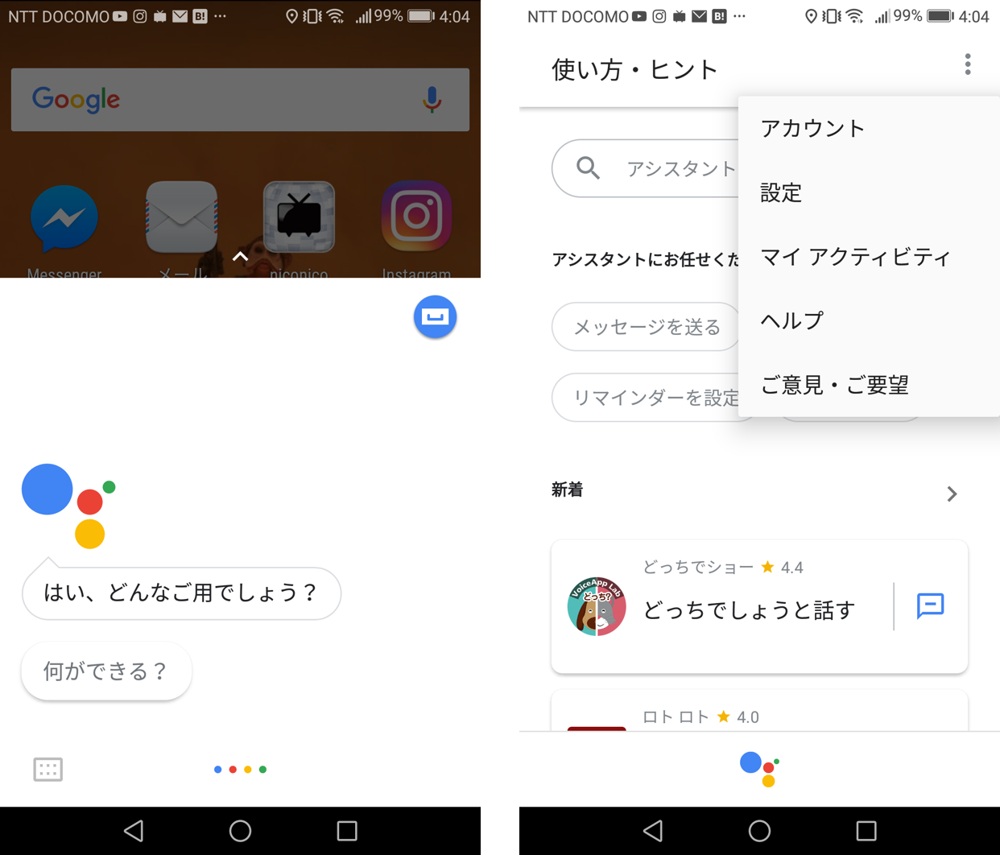
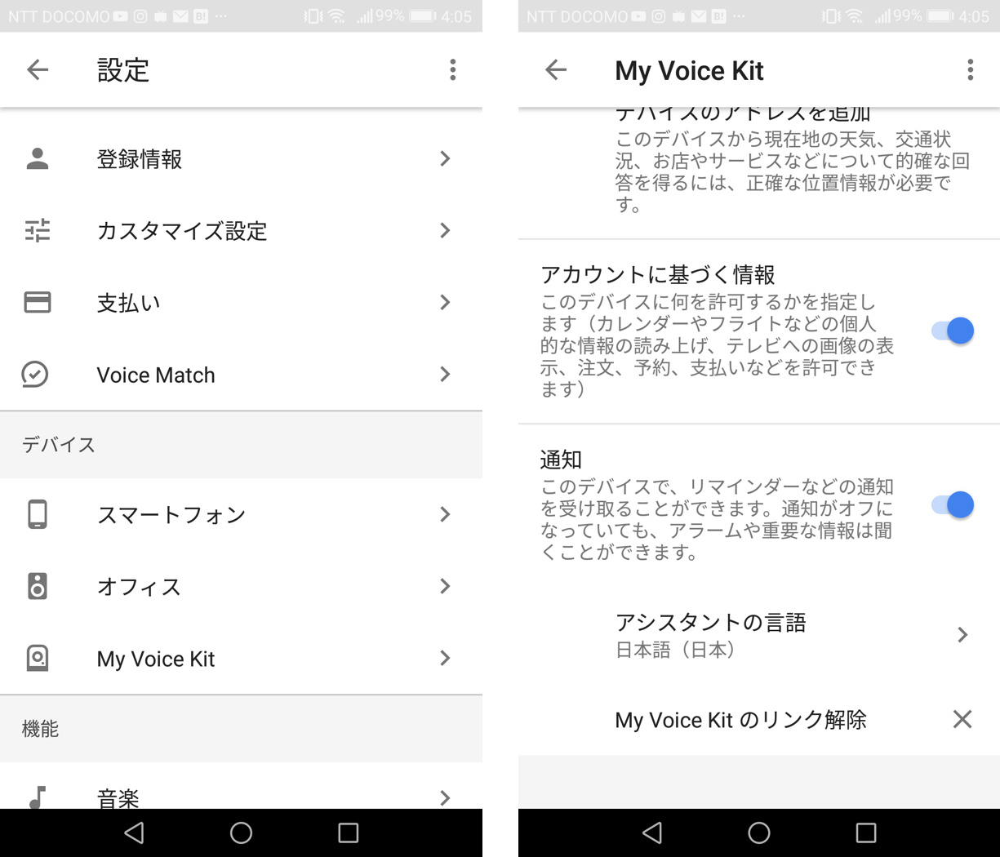

# GoogleAssistantアプリによる日本語設定方法

## 前提条件
aptパッケージ、aiyprojectのリポジトリを最新のものにpull、google-assistant-library[samples]とgoogle-auth-oauthlib[tool]のpipパッケージを最新にアップデート

GCPによるOAuth認証情報のダウンロードと認証が完了していること

## モデルの登録
```sh
cd ~
googlesamples-assistant-devicetool register-model --manufacturer "developer" --product-name "my-voicekit1" --type LIGHT --trait action.devices.traits.OnOff --model {{model name}}
# 確認
googlesamples-assistant-devicetool list --model
```

## デバイスの登録
```sh
cd ~
googlesamples-assistant-devicetool register-device --client-type LIBRARY --model {{model name}} --device {{device name}}
# 確認
googlesamples-assistant-devicetool list --device
```

## スマートフォンから日本語指定
スマートフォンからGoogleAssistantアプリを立ち上げます。Android端末をお持ちの場合はホームボタンを長押しします。

GoogleAssistantアプリが画面下半分に表示されるので右上にある青いボタンを押します。

使い方・ヒントの画面が表示されたら右上のボタンを押し、「設定」を押します。



設定画面が表示されたら「デバイス」の項目に登録したデバイスが表示されます。ここに表示される名前はデバイス登録時に指定した「ProductName」です。

デバイス名をタップし、「アシスタントの言語」の項目を「日本語(日本)」に設定して完了です。



## pushtotalkサンプルの実行
```sh
cd ~
googlesamples-assistant-pushtotalk --lang "ja-JP" --device-id {{device id}}
# enterを押して発話
```

## grpcサンプルの実行
```sh
# start dev terminalを立ち上げる
wget https://raw.githubusercontent.com/garicchi/voicekit-sample/develop/assistant_push_demo.py
python assistant_push_demo.py
```
